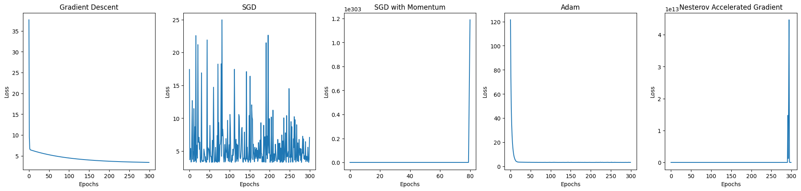

# Optimization Algorithms in Linear Regression

This project demonstrates the implementation of various gradient-based optimization algorithms for training a simple linear regression model. The goal is to compare their performance in terms of loss reduction across epochs.

## Dataset
A simple dataset is generated where:
- `y = 2 * x + 3` with added Gaussian noise.

The dataset includes `100` samples, and we fit a linear model using different optimization techniques.

## Linear Model
We fit a linear model to predict:

$$
\[ \hat{y} = \theta_0 + \theta_1 \cdot x \]
$$

Where:
- $\theta_0$ is the bias (intercept),
- $\theta_1$ is the weight (slope),
- $x$ is the input feature.

## Loss Function
We use the **Mean Squared Error (MSE)** to evaluate the performance:

$$
\[ \text{MSE} = \frac{1}{m} \sum_{i=1}^{m} (\hat{y}_i - y_i)^2 \]
$$

Where:
- $m$ is the number of samples,
- $y_i$ is the true value,
- $\hat{y}_i$ is the predicted value.

## Optimization Algorithms

### 1. **Gradient Descent (GD)**
This is the standard batch gradient descent, where all data points are used to compute the gradients and update the parameters.
The weight update rule is:

$$
\[ \theta = \theta - \alpha \cdot \nabla_\theta J(\theta) \]
$$

Where:
- $\alpha$ is the learning rate,
- $\( \nabla_\theta J(\theta) \)$ is the gradient of the loss function with respect to the parameters.

### 2. **Stochastic Gradient Descent (SGD)**
In SGD, a single random sample is used to compute the gradient, making it faster but noisier. The update rule is the same as in GD, but it uses a single data point at each step.

### 3. **SGD with Momentum**
Momentum adds a velocity term that helps accelerate gradient descent by smoothing oscillations. The update rule is:
$\[ v_t = \beta \cdot v_{t-1} - \alpha \cdot \nabla_\theta J(\theta) \]$
$\[ \theta = \theta + v_t \]$
Where:
- $\beta$ is the momentum factor,
- $v_t$ is the velocity (previous gradient history).

### 4. **Adam Optimizer**
Adam is an adaptive learning rate method that keeps track of both the first moment (mean) and second moment (uncentered variance) of the gradients. The update rule is:

$$
\[ m_t = \beta_1 \cdot m_{t-1} + (1 - \beta_1) \cdot g_t \]
$$

$$
\[ v_t = \beta_2 \cdot v_{t-1} + (1 - \beta_2) \cdot g_t^2 \]
$$

$$
\[ \theta = \theta - \alpha \cdot \frac{m_t}{\sqrt{v_t} + \epsilon} \]
$$

Where:
- $\( \beta_1, \beta_2 \)$ control the decay rates of the moment estimates,
- $\( \epsilon \)$ is a small constant to avoid division by zero.

### 5. **Nesterov Accelerated Gradient (NAG)**
NAG looks ahead by computing the gradient based on the anticipated future position of the parameters:
$\[ \theta_{\text{lookahead}} = \theta + \beta \cdot v \]$
The gradients are computed based on this lookahead position, leading to more informed updates.

## Results
The loss history for each optimizer is plotted over 300 epochs to visually compare their performance. The plot illustrates how each optimization technique minimizes the loss over time.

### Plot
The figure contains subplots showing the loss curves for each optimizer:
1. **Gradient Descent**
2. **Stochastic Gradient Descent**
3. **SGD with Momentum**
4. **Adam**
5. **Nesterov Accelerated Gradient**

\

## Usage
The optimizers are implemented in Python using numpy and matplotlib for plotting. To run the code, simply execute the script, and it will generate and display the comparison plot of loss curves for each optimizer.

## License

This project is licensed under the MIT License - see the LICENSE file for details.
